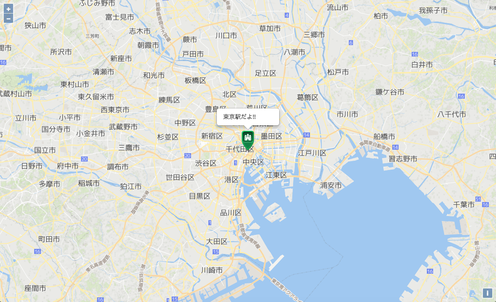

# MIERUNE地図 - OpenLayers

<br>

## Getting Started

### MIERUNE地図表示 -「Free」プラン


example path
```
./src/001
```

index.html
```html
<!DOCTYPE html>
<html lang="ja">
    <head>
        <meta charset="UTF-8">
        <title>OpenLayers example</title>

        <!--OpenLayers 読み込み-->
        <script src="https://openlayers.org/en/v5.0.2/build/ol.js"></script>
        <link href="https://openlayers.org/en/v5.0.2/css/ol.css" rel="stylesheet"/>

        <link href="./css/stylesheet.css" rel="stylesheet"/>

    </head>
    <body>

        <div id="map"></div>

        <script src="./js/script.js"></script>

    </body>
</html>
```

stylesheet.css
```css
html, body {
    height: 100%;
    padding: 0;
    margin: 0;
}

#map {
    z-index: 0;
    height: 100%;
}
```

script.js
```javascript
// スタイル: mierune, mierune_mono
var style = "mierune_mono";

// URL設定
var url = "https://tile.mierune.co.jp/" + style + "/{z}/{x}/{y}.png";

// MIERUNE地図 読み込み
var layer = [];
layer[0] = new ol.layer.Tile({
    source: new ol.source.XYZ({
        url: url,
        attributions: "Maptiles by <a href='http://mierune.co.jp/' target='_blank'>MIERUNE</a>, under CC BY. Data by <a href='http://osm.org/copyright' target='_blank'>OpenStreetMap</a> contributors, under ODbL.",
        maxZoom: 18
    })
});

// 地図画面表示
var map = new ol.Map({
	target: "map",
    view: new ol.View({
      center: ol.proj.fromLonLat([139.767, 35.681]),
      zoom: 11
    }),
    layers: layer
});
```

<br>

---

<br>

### MIERUNE地図表示 -「Standard, Premium, Global Scale」プラン


example path
```
./src/002
```

index.html
```html
<!DOCTYPE html>
<html lang="ja">
    <head>
        <meta charset="UTF-8">
        <title>OpenLayers example</title>

        <!--OpenLayers 読み込み-->
        <script src="https://openlayers.org/en/v5.0.2/build/ol.js"></script>
        <link href="https://openlayers.org/en/v5.0.2/css/ol.css" rel="stylesheet"/>

        <link href="./css/stylesheet.css" rel="stylesheet"/>

    </head>
    <body>

        <div id="map"></div>

        <script src="./js/script.js"></script>

    </body>
</html>
```

stylesheet.css
```css
html, body {
    height: 100%;
    padding: 0;
    margin: 0;
}

#map {
    z-index: 0;
    height: 100%;
}
```

script.js
```javascript
// 「Standard, Premium, Global Scale」プラン 認証キー
var apikey = "xxxxxxxxxx";

// スタイル: normal, gray, bright, blue, warm, MIERUNE
var style = "normal";

// URL設定
var url = "https://tile.cdn.mierune.co.jp/styles/" + style + "/{z}/{x}/{y}.png" + "?key=" + apikey;

// MIERUNE地図 読み込み
var layer = [];
layer[0] = new ol.layer.Tile({
    source: new ol.source.XYZ({
        url: url,
        attributions: "Maptiles by <a href='http://mierune.co.jp/' target='_blank'>MIERUNE</a>, under CC BY. Data by <a href='http://osm.org/copyright' target='_blank'>OpenStreetMap</a> contributors, under ODbL.",
        maxZoom: 18
    })
});

// 地図画面表示
var map = new ol.Map({
	target: "map",
    view: new ol.View({
      center: ol.proj.fromLonLat([139.767, 35.681]),
      zoom: 11
    }),
    layers: layer
});
```

<br>

---

<br>

### マーカー・ポップアップ表示



index.html
```html
<!--jQuery 読み込み-->
<script src="https://code.jquery.com/jquery-2.2.3.min.js"></script>

<!--Bootstrap 読み込み-->
<script src="https://maxcdn.bootstrapcdn.com/bootstrap/3.3.7/js/bootstrap.min.js"></script>
<link href="https://maxcdn.bootstrapcdn.com/bootstrap/3.3.7/css/bootstrap.min.css" rel="stylesheet">

<div id="map"><div id="popup"></div></div>
```

stylesheet.css
```css
.popover{
    width: 150px;
}
```

script.js
```javascript
// マーカー設定
var Map_Point = new ol.Feature({
    geometry: new ol.geom.Point(ol.proj.fromLonLat([139.767, 35.681])),
    name: '東京駅だよ!!'
});
var styles = new ol.style.Style({
        image: new ol.style.Icon({
            anchor: [0.5, 1],
            src: 'https://openlayers.org/en/v5.0.2/examples/data/icon.png'
        })
    });
layer[1] = new ol.layer.Vector({
    source: new ol.source.Vector({
        features: [Map_Point]
    }),
    style: styles
});

// ポップアップ設定
var element = document.getElementById('popup');
var popup = new ol.Overlay({
    element: element,
    positioning: 'bottom-center',
    stopEvent: false,
    offset: [0, -50]
});
map.addOverlay(popup);
map.on('click', function(evt) {
    var feature = map.forEachFeatureAtPixel(evt.pixel,
        function(feature) {
            return feature;
        });
    if (feature) {
        var coordinates = feature.getGeometry().getCoordinates();
        popup.setPosition(coordinates);
        $(element).popover({
            'placement': 'top',
            'html': true,
            'content': feature.get('name')
        });
        $(element).popover('show');
    } else {
        $(element).popover('destroy');
    }
});
```

<br>

---

<br>

## Other information

- [OpenLayers](https://openlayers.org)  
- [OpenLayers Quick Start](https://openlayers.org/en/latest/doc/quickstart.html)   
- [OpenLayers API Docs](https://openlayers.org/en/latest/apidoc)  